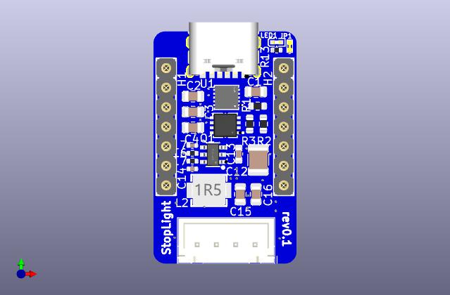
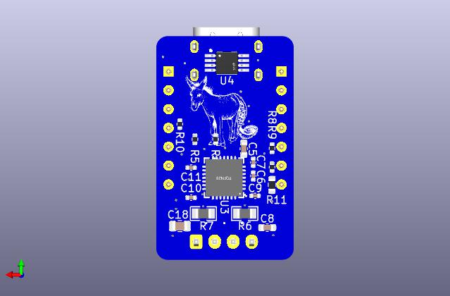
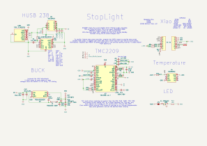

# Stoplight



Stoplight is a Xiao shield for operating small stepper motors. It is designed
specifically for 28-BYJ48, although it _may_ work with other small steppers as
well. It aims to provide utility all around the home, and is especially useful
when working with blinds and knobs.



Commercial stepsticks have sense resistors that are not properly sized for
'smaller' motors to take advantage of many of TMC2209's features, including
stallguard.

> StopLight brings stall sensing to commodity/low cost, high torque motors.

Stoplight seeks to remedy these issues, while also providing software selectable
voltage control and temperature measurement in a package that works well with
HomeAssistant/ESPHome.

### Todo 

- [ ] TVS Protection
- [ ] Change C14 to same as C18 (BOM Consolidation)
- [ ] Consider removing DIAG and just using UART events instead
- [ ] Consider reconneacting fan port
- [ ] Address DS18B20U reading high 
- [ ] Test fit in mini blind housing
- [ ] Dim LED brightness
- [x] Test StallGuard tuning
  - works well at 12+v ✅
  - 9v is untested ⚠️
  - 5v is more finicky
- [x] Add esphome sample yaml's

## Homing


## Fabrication

Use the [production files](jlcpcb/production_files/) to upload to jlc.

You'll need to swap the motor wires to a JST XH 4 pin housing. In addition to
removing the red cable, you also **must** perform the
[bipolar mod](https://ardufocus.com/howto/28byj-48-bipolar-hw-mod/) on your
steppers.

## Example HomeAssistant Config

The build sometimes fails, but can usually be completed by repeatedly pressing
'Retry', or switching to 'arduino' framework.

### Tuning

<details><summary>This demo exposes a number of controls to make tuning StallGuard easier.</summary>

```yaml
substitutions:
  name: "stoplight"
  friendly_name: "StopLight"
  board: "seeed_xiao_esp32c3"

# board/wifi/ota stuff
packages:
  device_base: !include .esp32.yaml

esp32:
  framework:
    type: esp-idf

logger:
  level: DEBUG

esphome:
  on_boot:
    - tmc2209.configure:
        direction: cw # or ccw
        microsteps: 1
        interpolation: True
        enable_spreadcycle: False
        tcool_threshold: 0
        tpwm_threshold: 0
    - tmc2209.stallguard:
        threshold: 23
    - tmc2209.currents:
        standstill_mode: freewheeling
        run_current: 0.150 # was 0.240
        hold_current: 0
    - button.press: home # home right after boot

external_components:
  - source: github://slimcdk/esphome-custom-components
    components: [tmc2209_hub, tmc2209, stepper]
  - source: github://pr#6693
    components: [husb238]

globals:
  - id: has_homed
    type: bool
    initial_value: "true"
    restore_value: no
  - id: homing_speed
    type: int
    initial_value: "480"
    restore_value: True

web_server:
  port: 80

i2c:
  sda: GPIO6
  scl: GPIO7
  frequency: 800kHz

uart:
  tx_pin: GPIO21
  rx_pin: GPIO20
  baud_rate: 500000 # 9600 -> 500k

one_wire:
  - platform: gpio
    pin: GPIO10

stepper:
  - platform: tmc2209
    id: driver
    # https://www.klipper3d.org/TMC_Drivers.html#limitations
    max_speed: 2000 steps/s # was 4000
    acceleration: 1000 steps/s^2 # was 2500
    deceleration: 1000 steps/s^2 # was 2500
    index_pin: GPIO3
    diag_pin: GPIO4
    rsense: 1000 mOhm
    config_dump_include_registers: False
    vsense: False
    analog_current_scale: False
    on_stall:
      - logger.log: "Motor stalled!"
      - if:
          condition:
            lambda: return !id(has_homed);
          then:
            - stepper.stop: driver
            - tmc2209.configure:
                direction: cw # or ccw
                microsteps: 1
                interpolation: True
                enable_spreadcycle: False
                tcool_threshold: 0
            - stepper.report_position:
                id: driver
                position: 0
            - globals.set:
                id: has_homed
                value: "true"
            - logger.log: "Home position set"
            - tmc2209.disable
    on_status:
      - logger.log:
          format: "Driver is reporting an update! (code %d)"
          args: ["code"]
      - if:
          condition:
            lambda: return code == tmc2209::DIAG_TRIGGERED;
          then:
            - logger.log: DIAG_TRIGGERED
      - if:
          condition:
            lambda: return code == tmc2209::DIAG_TRIGGER_CLEARED;
          then:
            - logger.log: DIAG_TRIGGER_CLEARED
      - if:
          condition:
            lambda: return code == tmc2209::RESET;
          then:
            - logger.log: RESET
      - if:
          condition:
            lambda: return code == tmc2209::RESET_CLEARED;
          then:
            - logger.log: RESET_CLEARED
      - if:
          condition:
            lambda: return code == tmc2209::DRIVER_ERROR;
          then:
            - logger.log: DRIVER_ERROR
      - if:
          condition:
            lambda: return code == tmc2209::DRIVER_ERROR_CLEARED;
          then:
            - logger.log: DRIVER_ERROR_CLEARED
      - if:
          condition:
            lambda: return code == tmc2209::CP_UNDERVOLTAGE;
          then:
            - logger.log: CP_UNDERVOLTAGE
      - if:
          condition:
            lambda: return code == tmc2209::CP_UNDERVOLTAGE_CLEARED;
          then:
            - logger.log: CP_UNDERVOLTAGE_CLEARED
      - if:
          condition:
            lambda: return code == tmc2209::OVERTEMPERATURE_PREWARNING;
          then:
            - logger.log: OVERTEMPERATURE_PREWARNING
      - if:
          condition:
            lambda: return code == tmc2209::OVERTEMPERATURE_PREWARNING_CLEARED;
          then:
            - logger.log: OVERTEMPERATURE_PREWARNING_CLEARED
      - if:
          condition:
            lambda: return code == tmc2209::OVERTEMPERATURE;
          then:
            - logger.log: OVERTEMPERATURE
      - if:
          condition:
            lambda: return code == tmc2209::OVERTEMPERATURE_CLEARED;
          then:
            - logger.log: OVERTEMPERATURE_CLEARED
      - if:
          condition:
            lambda: return code == tmc2209::TEMPERATURE_ABOVE_120C;
          then:
            - logger.log: TEMPERATURE_ABOVE_120C
      - if:
          condition:
            lambda: return code == tmc2209::TEMPERATURE_BELOW_120C;
          then:
            - logger.log: TEMPERATURE_BELOW_120C
      - if:
          condition:
            lambda: return code == tmc2209::TEMPERATURE_ABOVE_143C;
          then:
            - logger.log: TEMPERATURE_ABOVE_143C
      - if:
          condition:
            lambda: return code == tmc2209::TEMPERATURE_BELOW_143C;
          then:
            - logger.log: TEMPERATURE_BELOW_143C
      - if:
          condition:
            lambda: return code == tmc2209::TEMPERATURE_ABOVE_150C;
          then:
            - logger.log: TEMPERATURE_ABOVE_150C
      - if:
          condition:
            lambda: return code == tmc2209::TEMPERATURE_BELOW_150C;
          then:
            - logger.log: TEMPERATURE_BELOW_150C
      - if:
          condition:
            lambda: return code == tmc2209::TEMPERATURE_ABOVE_157C;
          then:
            - logger.log: TEMPERATURE_ABOVE_157C
      - if:
          condition:
            lambda: return code == tmc2209::TEMPERATURE_BELOW_157C;
          then:
            - logger.log: TEMPERATURE_BELOW_157C
      - if:
          condition:
            lambda: return code == tmc2209::OPEN_LOAD;
          then:
            - logger.log: OPEN_LOAD
      - if:
          condition:
            lambda: return code == tmc2209::OPEN_LOAD_CLEARED;
          then:
            - logger.log: OPEN_LOAD_CLEARED
      - if:
          condition:
            lambda: return code == tmc2209::OPEN_LOAD_A;
          then:
            - logger.log: OPEN_LOAD_A
      - if:
          condition:
            lambda: return code == tmc2209::OPEN_LOAD_A_CLEARED;
          then:
            - logger.log: OPEN_LOAD_A_CLEARED
      - if:
          condition:
            lambda: return code == tmc2209::OPEN_LOAD_B;
          then:
            - logger.log: OPEN_LOAD_B
      - if:
          condition:
            lambda: return code == tmc2209::OPEN_LOAD_B_CLEARED;
          then:
            - logger.log: OPEN_LOAD_B_CLEARED
      - if:
          condition:
            lambda: return code == tmc2209::LOW_SIDE_SHORT;
          then:
            - logger.log: LOW_SIDE_SHORT
      - if:
          condition:
            lambda: return code == tmc2209::LOW_SIDE_SHORT_CLEARED;
          then:
            - logger.log: LOW_SIDE_SHORT_CLEARED
      - if:
          condition:
            lambda: return code == tmc2209::LOW_SIDE_SHORT_A;
          then:
            - logger.log: LOW_SIDE_SHORT_A
      - if:
          condition:
            lambda: return code == tmc2209::LOW_SIDE_SHORT_A_CLEARED;
          then:
            - logger.log: LOW_SIDE_SHORT_A_CLEARED
      - if:
          condition:
            lambda: return code == tmc2209::LOW_SIDE_SHORT_B;
          then:
            - logger.log: LOW_SIDE_SHORT_B
      - if:
          condition:
            lambda: return code == tmc2209::LOW_SIDE_SHORT_B_CLEARED;
          then:
            - logger.log: LOW_SIDE_SHORT_B_CLEARED
      - if:
          condition:
            lambda: return code == tmc2209::GROUND_SHORT;
          then:
            - logger.log: GROUND_SHORT
      - if:
          condition:
            lambda: return code == tmc2209::GROUND_SHORT_CLEARED;
          then:
            - logger.log: GROUND_SHORT_CLEARED
      - if:
          condition:
            lambda: return code == tmc2209::GROUND_SHORT_A;
          then:
            - logger.log: GROUND_SHORT_A
      - if:
          condition:
            lambda: return code == tmc2209::GROUND_SHORT_A_CLEARED;
          then:
            - logger.log: GROUND_SHORT_A_CLEARED
      - if:
          condition:
            lambda: return code == tmc2209::GROUND_SHORT_B;
          then:
            - logger.log: GROUND_SHORT_B
      - if:
          condition:
            lambda: return code == tmc2209::GROUND_SHORT_B_CLEARED;
          then:
            - logger.log: GROUND_SHORT_B_CLEARED

button:
  - platform: template
    name: Home
    id: home
    on_press:
      - logger.log: "Going home!"
      - tmc2209.configure:
          direction: cw # or ccw
          microsteps: 1
          interpolation: True
          enable_spreadcycle: False
          tcool_threshold: 104
          tpwm_threshold: 0
      # - lambda: id(driver)->write_register(TPWMTHRS, 0);
      # - lambda: id(driver)->write_register(TCOOLTHRS, 1048575);
      - globals.set:
          id: has_homed
          value: "false"
      - stepper.set_speed:
          id: driver
          # 60 to 300 rpm
          speed: !lambda return id(homing_speed);
      - stepper.set_target:
          id: driver
          target: -9999999
  - platform: template
    name: Stop
    id: stop
    on_press:
      - logger.log: "Stopping!"
      - stepper.stop: driver
      - tmc2209.disable
  - platform: template
    name: 1000 Steps forward
    on_press:
      - logger.log: "Going forward!"
      - stepper.set_speed:
          id: driver
          speed: 400 steps/s
      - stepper.set_target:
          id: driver
          target: !lambda return id(driver)->current_position +1000;
      # - tmc2209.disable

husb238:
  id: husb_01

binary_sensor:
  - platform: husb238
    attached: "PD Attached"

  - platform: template
    name: "Has Homed"
    lambda: return id(has_homed);

text_sensor:
  - platform: husb238
    status: "Last request status"
    capabilities: "Capabilities"

select:
  - platform: husb238
    voltage: "Voltage selector"

sensor:
  - platform: husb238
    voltage: "Contracted Voltage"
    current: "Contracted Current"
    selected_voltage: "Selected Voltage"

  - platform: dallas_temp
    name: temperature

  - platform: tmc2209
    type: stallguard_result
    name: Driver stallguard
    update_interval: 10s

  - platform: tmc2209
    type: actual_current
    name: Actual current
    update_interval: 10s

  - platform: tmc2209
    type: motor_load
    name: Motor load
    update_interval: 10s

  # - platform: tmc2209
  #   type: pwm_scale_sum
  #   name: PWM Scale Sum
  #   update_interval: 250ms

  # - platform: tmc2209
  #   type: pwm_scale_auto
  #   name: PWM Scale Auto
  #   update_interval: 250ms

  # - platform: tmc2209
  #   type: pwm_ofs_auto
  #   name: PWM OFS Auto
  #   update_interval: 250ms

  # - platform: tmc2209
  #   type: pwm_grad_auto
  #   name: PWM Grad Auto
  #   update_interval: 250ms

number:
  - platform: template
    name: Target position
    min_value: -999999
    max_value: 999999
    step: 100
    lambda: return id(driver)->current_position;
    update_interval: 10s
    set_action:
      - stepper.set_target:
          id: driver
          target: !lambda "return x;"

  - platform: template
    name: Homing RPM
    min_value: 0
    max_value: 300
    step: 1
    lambda: return id(homing_speed) * 60 / 32;
    update_interval: 10s
    set_action:
      - globals.set:
          id: homing_speed
          value: !lambda "return x * 32 / 60;"

  - platform: template
    name: SGTHRS
    min_value: 0
    max_value: 255
    step: 1
    lambda: return id(driver)->read_register(SGTHRS);
    update_interval: 10s
    set_action:
      - lambda: id(driver)->write_register(SGTHRS, x);

  - platform: template
    name: TCOOLTHRS
    min_value: 0
    max_value: 1048575
    step: 1
    lambda: return id(driver)->read_register(TCOOLTHRS);
    update_interval: 10s
    set_action:
      - lambda: id(driver)->write_register(TCOOLTHRS, x);

  - platform: template
    name: "Run Current"
    min_value: 0
    max_value: 31
    step: 1
    lambda: return id(driver)->read_field(IRUN_FIELD);
    update_interval: 10s
    set_action:
      - tmc2209.currents:
          irun: !lambda "return x;"
```
</details>

### Wall Heater

<details><summary>This demo implements a knob controlled wall heater.</summary>

```yaml
substitutions:
  name: "heater"
  friendly_name: "Wall Heater"
  board: "seeed_xiao_esp32c3"

# board/wifi/ota stuff
packages:
  device_base: !include .esp32.yaml

esphome:
  on_boot:
    # - lambda: id(husb_01)->command_request_voltage(5);
    - tmc2209.configure:
        direction: cw # or ccw
        microsteps: 1
        interpolation: True
        enable_spreadcycle: False
        tcool_threshold: 0
        tpwm_threshold: 0
    - tmc2209.stallguard:
        threshold: 23
    - tmc2209.currents:
        standstill_mode: freewheeling
        run_current: 0.1375 # was 0.150
        hold_current: 0
    - button.press: probe_low # home right after boot

external_components:
  - source: github://slimcdk/esphome-custom-components
    components: [ tmc2209_hub, tmc2209, stepper ]
  - source: github://pr#6693
    components: [ husb238 ]

globals:
  - id: steps
    type: int
    restore_value: yes
    initial_value: "1000"

i2c:
  sda: GPIO6
  scl: GPIO7 
  frequency: 800kHz

uart:
  tx_pin: GPIO21
  rx_pin: GPIO20
  baud_rate: 500000 # 9600 -> 500k

one_wire:
  - platform: gpio
    pin: GPIO10

husb238:
  id: husb_01

stepper:
  - platform: tmc2209
    id: driver
    max_speed: 480 steps/s
    acceleration: 1000 steps/s^2 
    deceleration: 1000 steps/s^2 
    index_pin: GPIO3
    diag_pin: GPIO4
    rsense: 1000 mOhm
    on_stall:
      - stepper.stop: driver
      - logger.log: Endstop Detected 🍍

script:
  - id: move_stepper
    mode: restart
    parameters:
      # use 0/false for low side endstop, 1/true for high side
      homing: bool
      target: int
    then:
      - lambda: id(husb_01)->command_request_voltage(20);
      - tmc2209.configure:
          tcool_threshold: !lambda 'return homing ? 104 : 0;'
      - stepper.set_speed:
          id: driver
          speed: 480 steps/s
      - delay: 1s
      - stepper.set_target:
          id: driver
          target: !lambda 'return target;'
      - wait_until:
          condition:
            lambda: 'return id(driver)->has_reached_target();'
      - logger.log:
          format: "Moved to %d steps"
          args: [ 'id(driver)->current_position' ]
      - tmc2209.disable:
          id: driver 
      - lambda: id(husb_01)->command_request_voltage(5);


button:
  - platform: template
    name: Probe Low
    id: probe_low 
    on_press:
      - climate.control:
          id: pid_climate
          mode: 'OFF'
      - script.execute: 
          id: move_stepper
          homing: true
          target: -9999999
      - script.wait: move_stepper
      - stepper.report_position:
          id: driver
          position: 0
      - logger.log:
          format: "Probed to %d steps"
          args: [ 'id(driver)->current_position' ]
      
  - platform: template
    name: Probe High
    id: probe_high
    on_press:
      - climate.control:
          id: pid_climate
          mode: 'OFF'
      - script.execute: 
          id: move_stepper
          homing: true
          target: 9999999
      - script.wait: move_stepper
      - globals.set:
          id: steps
          value: !lambda 'return id(driver)->current_position;'
 
  - platform: template
    name: "PID Climate Autotune"
    on_press:
      - climate.pid.autotune: pid_climate

sensor:
  - platform: husb238
    voltage: "Contracted Voltage"

  - platform: template
    name: "Steps"
    id: steps_display
    icon: "mdi:shoe-print"
    accuracy_decimals: 0
    lambda: 'return id(steps);'

  - platform: dallas_temp
    id: ds_temp
    filters: 
      - lambda: return x - 13.5;

  # This sensor takes the output from the pid heater and transforms it to step numbers
  - platform: pid
    name: "PID Climate Heat"
    id: heat_float
    type: HEAT
    filters:
      - round_to_multiple_of: 10
      - delta: 9
    on_value:
      then:
        - script.execute: 
            id: move_stepper
            homing: false
            target: !lambda 'return static_cast<int>(id(steps) * (x / 100));'


# This is just a fake output to make the pid heater happy.
# Ideally, the pin will use the onboard led, but I'm not sure what the pin number is for that...
output:
  - platform: ledc
    pin: GPIO2
    id: heater_output

# Example configuration entry
climate:
  - platform: pid
    name: "PID Climate Controller"
    id: pid_climate
    sensor: ds_temp
    default_target_temperature: 21°C
    heat_output: heater_output
    control_parameters:
      kp: 4
      ki: 0.4
      kd: 0.5
      output_averaging_samples: 5      # smooth the output over 5 samples
      derivative_averaging_samples: 5  # smooth the derivative value over 5 samples
    # deadband_parameters:
    #   threshold_high: 0.5°C
    #   threshold_low: -1.0°C
    #   kp_multiplier: 0.5   # proportional gain reduced inside deadband
    #   ki_multiplier: 0.25   # integral accumulates at only 25% of normal ki
    #   kd_multiplier: 0.5   # derviative is reduced inside deadband
    #   deadband_output_averaging_samples: 5   # average the output over 15 samples within the deadband
```

</details>

### Blinds

<details><summary>StallGuard blinds operation</summary>

```yaml
substitutions:
  name: "blins03"
  blind_number: right
  friendly_name: "Right Blind"
  board: "seeed_xiao_esp32c3"
  delay: "1s"

# board/wifi/ota stuff
packages:
  device_base: !include .esp32.yaml

esphome:
  on_boot:
    - tmc2209.configure:
        direction: ccw # or ccw
        microsteps: 1
        interpolation: True
        enable_spreadcycle: False
        tcool_threshold: 0
        tpwm_threshold: 0
    - tmc2209.stallguard:
        threshold: 45 
    - tmc2209.currents:
        standstill_mode: freewheeling
        run_current: 0.1375 # was 0.150
        hold_current: 0

external_components:
  - source: github://slimcdk/esphome-custom-components
    components: [ tmc2209_hub, tmc2209, stepper ]
  - source: github://pr#6693
    components: [ husb238 ]

globals:
  - id: steps
    type: int
    restore_value: yes
    initial_value: "1000"

i2c:
  sda: GPIO6
  scl: GPIO7 
  frequency: 800kHz

uart:
  tx_pin: GPIO21
  rx_pin: GPIO20
  baud_rate: 500000 # 9600 -> 500k

one_wire:
  - platform: gpio
    pin: GPIO10

husb238:
  id: husb_01

stepper:
  - platform: tmc2209
    id: driver
    max_speed: 480 steps/s
    acceleration: 1000 steps/s^2 
    deceleration: 1000 steps/s^2 
    index_pin: GPIO3
    diag_pin: GPIO4
    rsense: 1000 mOhm
    on_stall:
      - stepper.stop: driver
      - logger.log: Endstop Detected 🍍

script:
  - id: move_stepper
    mode: restart
    parameters:
      # use 0/false for low side endstop, 1/true for high side
      homing: bool
      target: int
    then:
      - lambda: id(husb_01)->command_request_voltage(12);
      - tmc2209.configure:
          tcool_threshold: !lambda 'return homing ? 104 : 0;'
      - stepper.set_speed:
          id: driver
          speed: !lambda 'return homing ? 480 : 120;'
      - delay: 1s
      - stepper.set_target:
          id: driver
          target: !lambda 'return target;'
      - while:
          condition:
            lambda: 'return !id(driver)->has_reached_target();'
          then:
            - cover.template.publish:
                id: ${name}_${blind_number}
                position: !lambda 'return float( id(driver).current_position ) / float( id(steps) );' 
                current_operation: !lambda 'return id(driver).current_position < id(driver).target_position ? COVER_OPERATION_OPENING : COVER_OPERATION_CLOSING;'
            - delay: ${delay}
      - logger.log:
          format: "Moved to %d steps"
          args: [ 'id(driver)->current_position' ]
      - tmc2209.disable:
          id: driver 
      - lambda: id(husb_01)->command_request_voltage(5);
      - cover.template.publish:
          id: ${name}_${blind_number}
          position: !lambda 'return float( id(driver).current_position ) / float( id(steps) );' 
          current_operation: IDLE

button:
  - platform: template
    name: Probe Low
    id: probe_low 
    on_press:
      - script.execute: 
          id: move_stepper
          homing: true
          target: -9999999
      - script.wait: move_stepper
      - stepper.report_position:
          id: driver
          position: 0
      - logger.log:
          format: "Probed to %d steps"
          args: [ 'id(driver)->current_position' ]
      
  - platform: template
    name: Probe High
    id: probe_high
    on_press:
      - script.execute: 
          id: move_stepper
          homing: true
          target: 9999999
      - script.wait: move_stepper
      - globals.set:
          id: steps
          value: !lambda 'return id(driver)->current_position;'

sensor:
  - platform: husb238
    voltage: "Contracted Voltage"

  - platform: template
    name: "Steps"
    id: steps_display
    icon: "mdi:shoe-print"
    accuracy_decimals: 0
    lambda: 'return id(steps);'

  - platform: dallas_temp
    id: ds_temp
    filters: 
      - lambda: return x - 13.5;

cover:
  - platform: template
    name: "${blind_number}"
    id: ${name}_${blind_number}
    open_action:
      then:
        - logger.log: "Opening"
        - button.press: probe_high
    close_action:
      then:
        - logger.log: "Closing"
        - button.press: probe_low
    position_action:
      then:
        - logger.log: "Jostling"
        - script.execute: 
            id: move_stepper
            homing: false
            target: !lambda return int(id(steps) * pos);
    stop_action:
      then:
        - script.execute: 
            id: move_stepper
            homing: false
            target: !lambda return id(driver).current_position;
    has_position: true
    device_class: blind

switch:
  - platform: template
    name: "Reset ${blind_number}"
    id: reset_${name}_${blind_number}
    turn_on_action:
      - button.press: probe_low
      - script.wait: move_stepper
      - button.press: probe_high
      - script.wait: move_stepper
      - button.press: probe_low
      - script.wait: move_stepper
      - switch.turn_off: reset_${name}_${blind_number}
```

</details>

## Schematic



## Reference

[TMC2209 Calaulations Worksheet](https://www.analog.com/media/en/engineering-tools/design-tools/TMC2209_Calculations.xlsx)

[BTT-TMC2209-v1.2](https://pax.deno.dev/bigtreetech/BIGTREETECH-TMC2209-V1.2@master/Schematic/TMC2209-V1.2.pdf?b)

[Cookie Robotics](https://cookierobotics.com/042/)

[jangeox](http://www.jangeox.be/2013/10/change-unipolar-28byj-48-to-bipolar.html)

