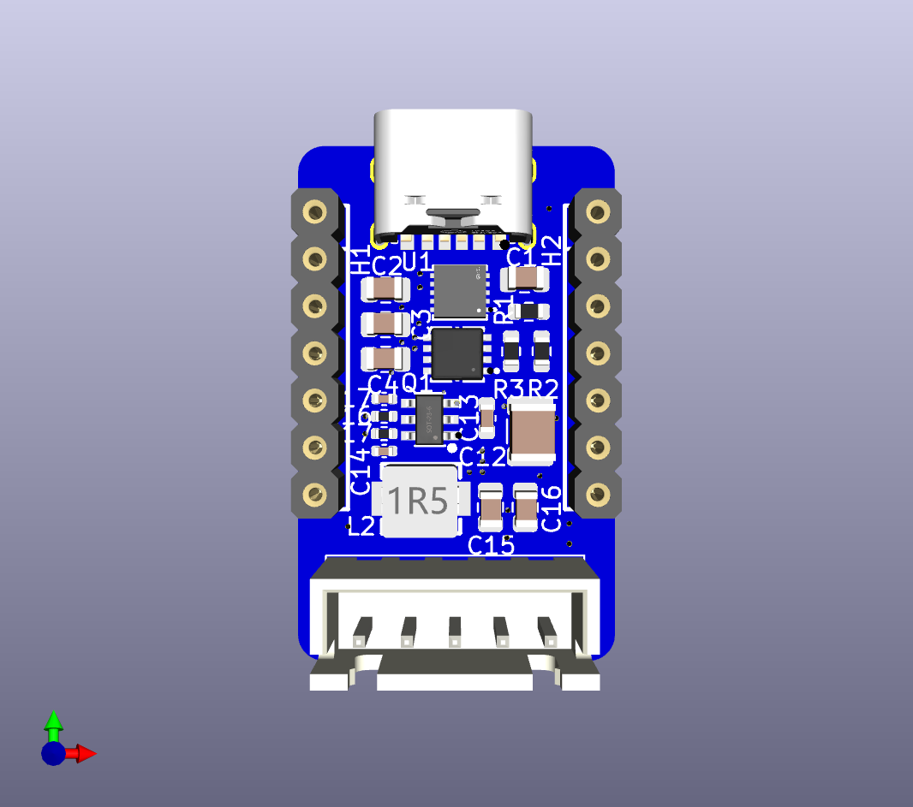
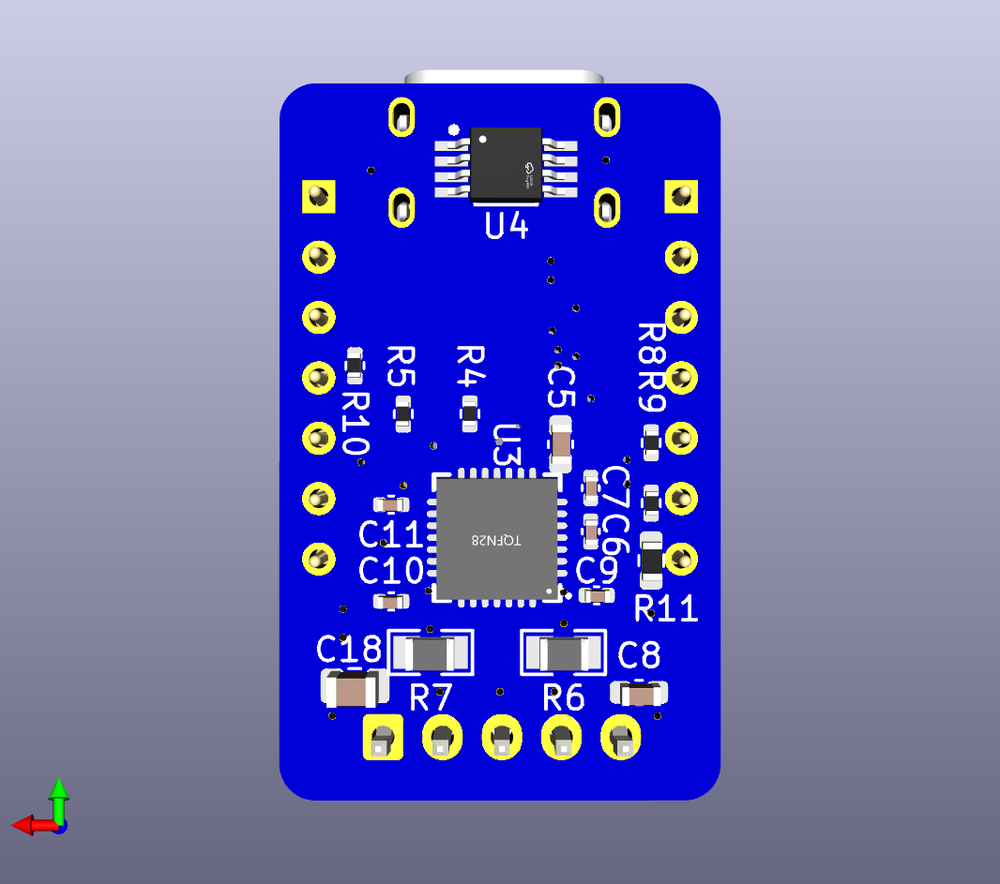

# The Pepper Stepper

> Put a little pep in your step



Pepper Stepper is a Xiao shield for operating small stepper motors. It is
designed specifically for 28-BYJ48, although it _may_ work with other small
steppers as well. It aims to provide utility all around the home, and is
especially useful when working with blinds and knobs.



Commercial stepsticks have sense resistors that are not properly sized for
'smaller' motors to take advantage of many of TMC2209's features, including
stallguard.

Pepper Stepper seeks to remedy these issues, while also providing software
selectable voltage control and temperature measurement in a package that works
well with HomeAssistant/ESPHome.

## Fabrication

Use the [production files](jlcpcb/production_files/) to upload to jlc.

> [!WARNING]
> Pepper stepper is WIP. It has been breadboarded but the first run has not yet
> been vetted. Proceed with caution.

In addition to removing the red cable, you also **must** perform the
[bipolar mod](https://ardufocus.com/howto/28byj-48-bipolar-hw-mod/) on your
steppers.

## Example HomeAssistant Config

```yaml
substitutions:
    name: "ipg"
    friendly_name: "IPG"
    board: "seeed_xiao_esp32c3"

# board/wifi/ota stuff
packages:
    device_base: !include .esp32.yaml

esp32:
    framework:
        type: arduino

esphome:
    on_boot:
        - tmc2209.configure:
              microsteps: 16
              interpolation: true
        - tmc2209.stallguard:
              threshold: 50
        - tmc2209.currents:
              standstill_mode: freewheeling
              run_current: 0.240
              hold_current: 0

external_components:
    - source: github://slimcdk/esphome-custom-components
      components: [tmc2209_hub, tmc2209, stepper]
    - source: github://pr#6693
      refresh: 10min
      components:
          - husb238

i2c:
    sda: GPIO6
    scl: GPIO7
    frequency: 800kHz

uart:
    tx_pin: GPIO21
    rx_pin: GPIO20
    baud_rate: 500000 # 9600 -> 500k

stepper:
    - platform: tmc2209
      id: driver
      max_speed: 4000 steps/s
      acceleration: 2500 steps/s^2
      deceleration: 2500 steps/s^2
      index_pin: GPIO3
      diag_pin: GPIO4
      rsense: 1.0
      # vsense will be true for pepper_stepper
      vsense: True
      analog_current_scale: False

husb238:
    id: husb_01

binary_sensor:
    - platform: husb238
      attached: "PD Attached"

text_sensor:
    - platform: husb238
      status: "Last request status"
      capabilities: "Capabilities"

select:
    - platform: husb238
      voltage: "Voltage selector"

sensor:
    - platform: husb238
      voltage: "Contracted Voltage"
      current: "Contracted Current"
      selected_voltage: "Selected Voltage"

    - platform: tmc2209
      type: stallguard_result
      name: Driver stallguard
      update_interval: 10s

    - platform: tmc2209
      type: actual_current
      name: Actual current
      update_interval: 10s

    # - platform: tmc2209
    #   type: motor_load
    #   name: Motor load
    #   update_interval: 250ms

    # - platform: tmc2209
    #   type: pwm_scale_sum
    #   name: PWM Scale Sum
    #   update_interval: 250ms

    # - platform: tmc2209
    #   type: pwm_scale_auto
    #   name: PWM Scale Auto
    #   update_interval: 250ms

    # - platform: tmc2209
    #   type: pwm_ofs_auto
    #   name: PWM OFS Auto
    #   update_interval: 250ms

    # - platform: tmc2209
    #   type: pwm_grad_auto
    #   name: PWM Grad Auto
    #   update_interval: 250ms
```

## Schematic


## Reference

[BTT-TMC2209-v1.2](https://pax.deno.dev/bigtreetech/BIGTREETECH-TMC2209-V1.2@master/Schematic/TMC2209-V1.2.pdf?b)
